# 📚 Biblioteca API

API RESTful desenvolvida em **C# .NET 10** com **Entity Framework Core** para gerenciar o acervo de uma biblioteca: cadastro de **autores** e de seus **livros**.

> Checkpoint 5: C# Software Development

## 👥 Integrantes

| Nome | RM |
|------|----|
| Ana Clara Melo | RM 559021 |
| David Murillo de Oliveira Soares | RM 559078 |
| Lucas Serrano | RM555170 |
| Yasmin Gonçalves Coelho | RM 559147 |


## 🎯 Contexto do projeto

**O que é:** um back-end para o controle de acervo de bibliotecas pequenas (escolares, comunitárias ou de empresas).

**Qual problema resolve:** muitas dessas bibliotecas ainda controlam os livros em planilhas ou cadernos. Isso gera cadastros duplicados, livros sem autor definido e nenhuma visão do estoque. A API centraliza essas informações e aplica regras de negócio automaticamente:

- cada livro pertence obrigatoriamente a um autor existente;
- o **ISBN é único**, então o mesmo livro não pode ser cadastrado duas vezes;
- um autor que tem livros no acervo **não pode ser excluído**, o que evita registros órfãos;
- os dados são validados (ISBN com 13 dígitos, ano de publicação válido, estoque não negativo etc.).

**Para quem é destinado:** bibliotecários e equipes que precisam de um sistema de catálogo, e desenvolvedores de front-end ou mobile que queiram consumir esses dados por HTTP.

## 🛠️ Tecnologias

- .NET 10 / ASP.NET Core Web API (Controllers)
- Entity Framework Core 10 (provider SQLite)
- Asp.Versioning (versionamento por segmento de URL: `/api/v1/...`)
- Swashbuckle / Swagger UI (documentação interativa)

## 🗄️ Banco de dados

**SQLite**, com o arquivo `biblioteca.db` criado automaticamente na pasta `BibliotecaApi/`.

A escolha do SQLite dispensa a instalação de servidor de banco: basta ter o SDK do .NET para rodar o projeto.

### Modelo de dados

```
Autores (1) ────────< (N) Livros
─────────────                ─────────────────────
Id (PK)                      Id (PK)
Nome                         Titulo
Nacionalidade                Isbn (UNIQUE)
DataNascimento               Genero
CriadoEm                     AnoPublicacao
                             QuantidadeEstoque
                             CriadoEm
                             AutorId (FK → Autores, ON DELETE RESTRICT)
```

### Migrations

As migrations ficam em [`BibliotecaApi/Migrations`](BibliotecaApi/Migrations).

| Migration | Descrição |
|-----------|-----------|
| `CriacaoInicial` | Cria as tabelas `Autores` e `Livros`, a FK `Livros.AutorId → Autores.Id` com `ON DELETE RESTRICT`, o índice único em `Livros.Isbn` e insere os dados iniciais (seed): 2 autores e 3 livros. |

Comandos usados:

```bash
# instalar a ferramenta do EF (uma única vez)
dotnet tool install --global dotnet-ef

# criar a migration
dotnet ef migrations add CriacaoInicial --project BibliotecaApi

# aplicar a migration no banco
dotnet ef database update --project BibliotecaApi
```

> A API também chama `Database.Migrate()` ao iniciar, então as migrations pendentes são aplicadas automaticamente na primeira execução.

## ▶️ Como rodar localmente

**Pré-requisito:** [.NET SDK 10](https://dotnet.microsoft.com/download/dotnet/10.0)

```bash
# 1. Clonar o repositório
git clone <url-do-repositorio>
cd <pasta-do-repositorio>

# 2. Restaurar e executar
dotnet run --project BibliotecaApi --launch-profile http
```

O navegador abre o **Swagger** em http://localhost:5003/swagger.

- Base URL da API: `http://localhost:5003/api/v1`
- Para voltar o banco ao estado inicial, pare a API e apague o arquivo `BibliotecaApi/biblioteca.db`. Ele será recriado na próxima execução.

Uma coleção do Postman com todos os cenários de teste está em [`docs/BibliotecaApi.postman_collection.json`](docs/BibliotecaApi.postman_collection.json).

## 🔗 Endpoints (v1)

### Autores

| Método | Rota | Descrição | Status codes |
|--------|------|-----------|--------------|
| GET | `/api/v1/autores` | Lista todos os autores | 200 |
| GET | `/api/v1/autores/{id}` | Busca um autor pelo id | 200, 404 |
| GET | `/api/v1/autores/{id}/livros` | Lista os livros de um autor | 200, 404 |
| POST | `/api/v1/autores` | Cadastra um autor | 201, 400 |
| PUT | `/api/v1/autores/{id}` | Atualiza um autor | 200, 400, 404 |
| DELETE | `/api/v1/autores/{id}` | Remove um autor sem livros | 204, 404, 409 |

### Livros

| Método | Rota | Descrição | Status codes |
|--------|------|-----------|--------------|
| GET | `/api/v1/livros` | Lista os livros (filtro opcional `?genero=`) | 200 |
| GET | `/api/v1/livros/{id}` | Busca um livro pelo id | 200, 404 |
| POST | `/api/v1/livros` | Cadastra um livro | 201, 400, 409 |
| PUT | `/api/v1/livros/{id}` | Atualiza um livro | 200, 400, 404, 409 |
| DELETE | `/api/v1/livros/{id}` | Remove um livro | 204, 404 |

### Exemplos de corpo (JSON)

**POST/PUT `/api/v1/autores`**
```json
{
  "nome": "George Orwell",
  "nacionalidade": "Britânica",
  "dataNascimento": "1903-06-25"
}
```

**POST/PUT `/api/v1/livros`**
```json
{
  "titulo": "1984",
  "isbn": "9788535914849",
  "genero": "Distopia",
  "anoPublicacao": 1949,
  "quantidadeEstoque": 7,
  "autorId": 3
}
```

### Significado dos status codes

| Código | Quando ocorre |
|--------|---------------|
| 200 OK | Consulta ou atualização bem-sucedida |
| 201 Created | Recurso criado; o header `Location` aponta para o novo recurso |
| 204 No Content | Recurso removido |
| 400 Bad Request | Dados inválidos (validação) ou `autorId` inexistente |
| 404 Not Found | Recurso não encontrado |
| 409 Conflict | ISBN duplicado ou tentativa de excluir autor com livros |

Os erros seguem o padrão **ProblemDetails (RFC 7807)**:

```json
{
  "title": "Recurso não encontrado",
  "status": 404,
  "detail": "Autor com id 99 não encontrado.",
  "instance": "/api/v1/autores/99"
}
```

## 🗂️ Estrutura do projeto

```
BibliotecaApi/
├── Controllers/V1/     # Controllers da versão 1 (AutoresController, LivrosController)
├── Data/               # BibliotecaDbContext: mapeamento das entidades e seed
├── Dtos/               # Contratos de entrada (Request) e saída (Response) com validações
├── Exceptions/         # Exceções de domínio (NotFound, BusinessRule, Conflict)
├── Middleware/         # GlobalExceptionHandler: converte exceções em ProblemDetails
├── Migrations/         # Migrations do EF Core
├── Models/             # Entidades Autor e Livro
├── Services/           # Regras de negócio e acesso a dados via EF Core
└── Program.cs          # Configuração de DI, EF Core, versionamento e Swagger
```

**Boas práticas aplicadas:**
- Separação em camadas (Controller → Service → DbContext)
- DTOs, para não expor as entidades diretamente
- Validação com Data Annotations e resposta 400 automática (`[ApiController]`)
- Tratamento global de erros com `IExceptionHandler` e `ProblemDetails`
- Consultas de leitura com `AsNoTracking()` e projeção direta para DTO
- Injeção de dependência e `CancellationToken` nas operações assíncronas

## 🧪 Evidências de testes

Prints dos testes de cada endpoint (Postman / Swagger):

| # | Cenário | Print |
|---|---------|-------|
| 1 | GET `/autores`: 200 |  |
| 2 | GET `/autores/{id}`: 200 |  |
| 3 | GET `/autores/{id}`: 404 |  |
| 4 | GET `/autores/{id}/livros`: 200 |  |
| 5 | POST `/autores`: 201 |  |
| 6 | POST `/autores`: 400 |  |
| 7 | PUT `/autores/{id}`: 200 |  |
| 8 | PUT `/autores/{id}`: 404 |  |
| 9 | GET `/livros`: 200 |  |
| 10 | GET `/livros?genero=romance`: 200 | 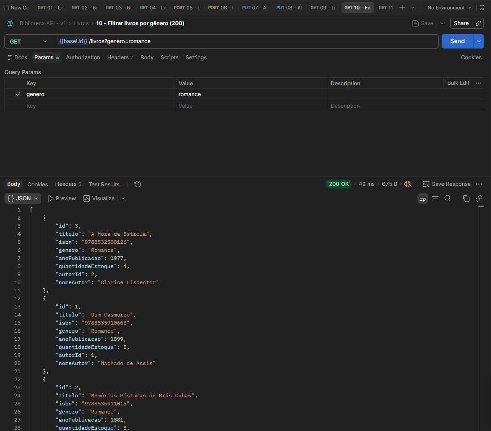 |
| 11 | GET `/livros/{id}`: 200 | 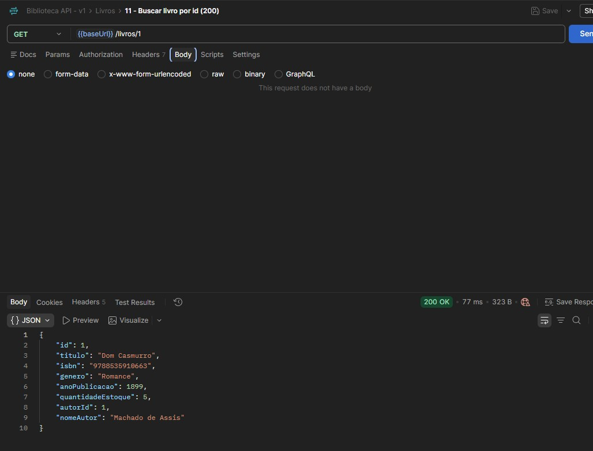 |
| 12 | GET `/livros/{id}`: 404 | 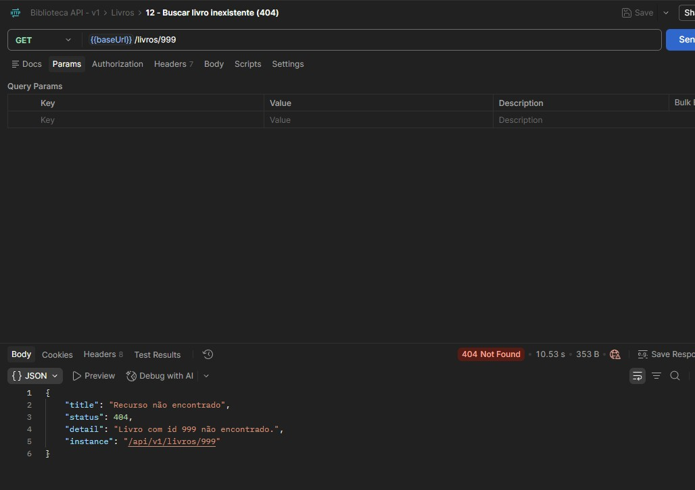 |
| 13 | POST `/livros`: 201 | 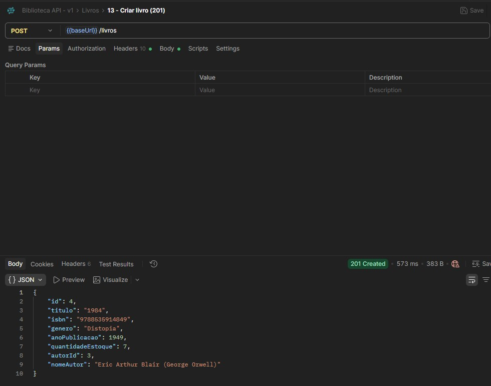 |
| 14 | POST `/livros`: 400 (validação) | 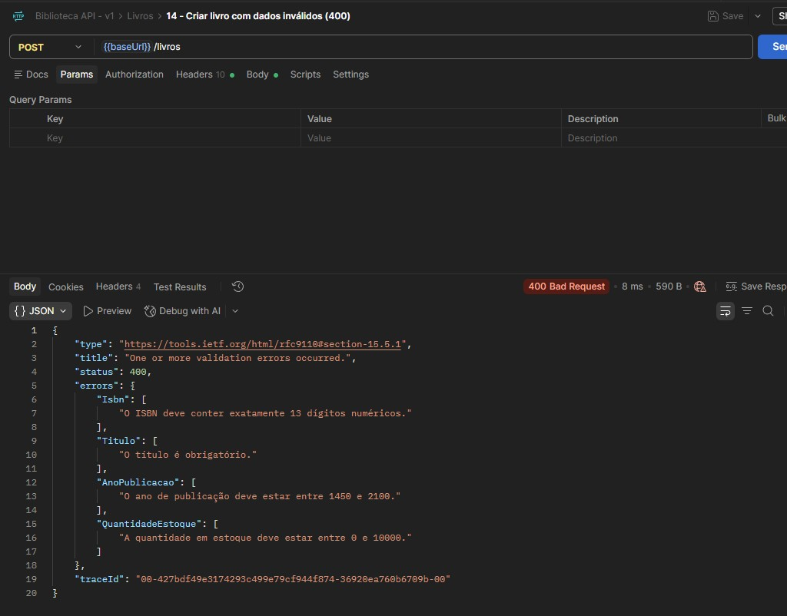 |
| 15 | POST `/livros`: 400 (autor inexistente) | 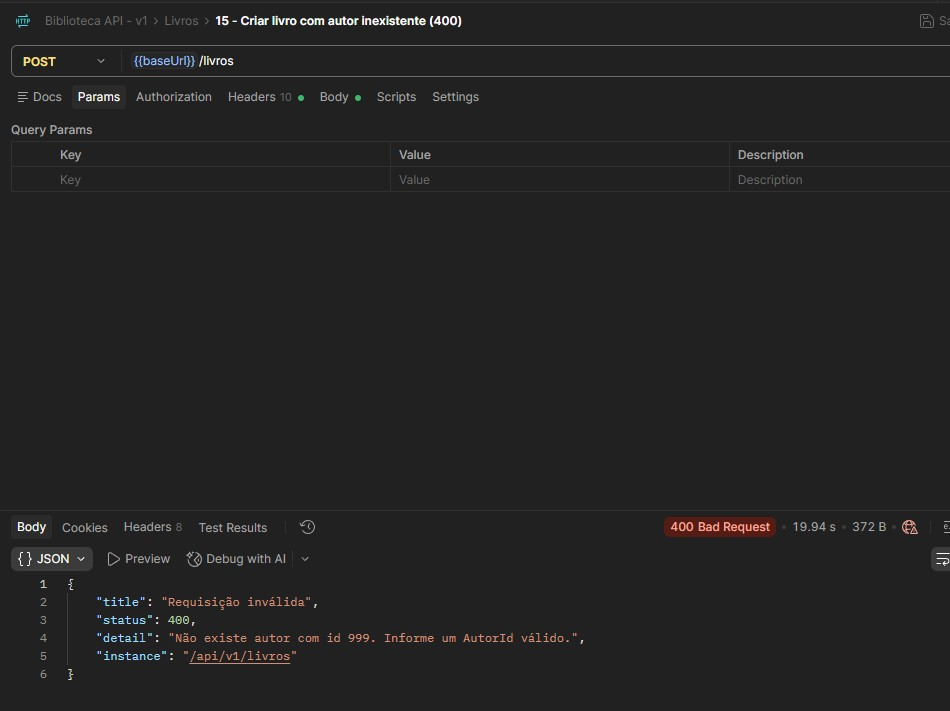 |
| 16 | POST `/livros`: 409 (ISBN duplicado) | 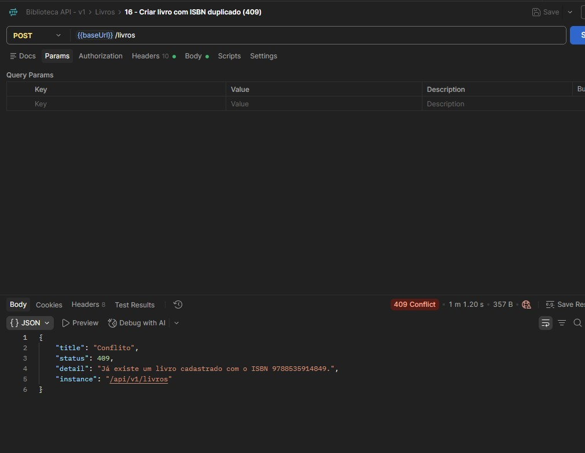 |
| 17 | PUT `/livros/{id}`: 200 | 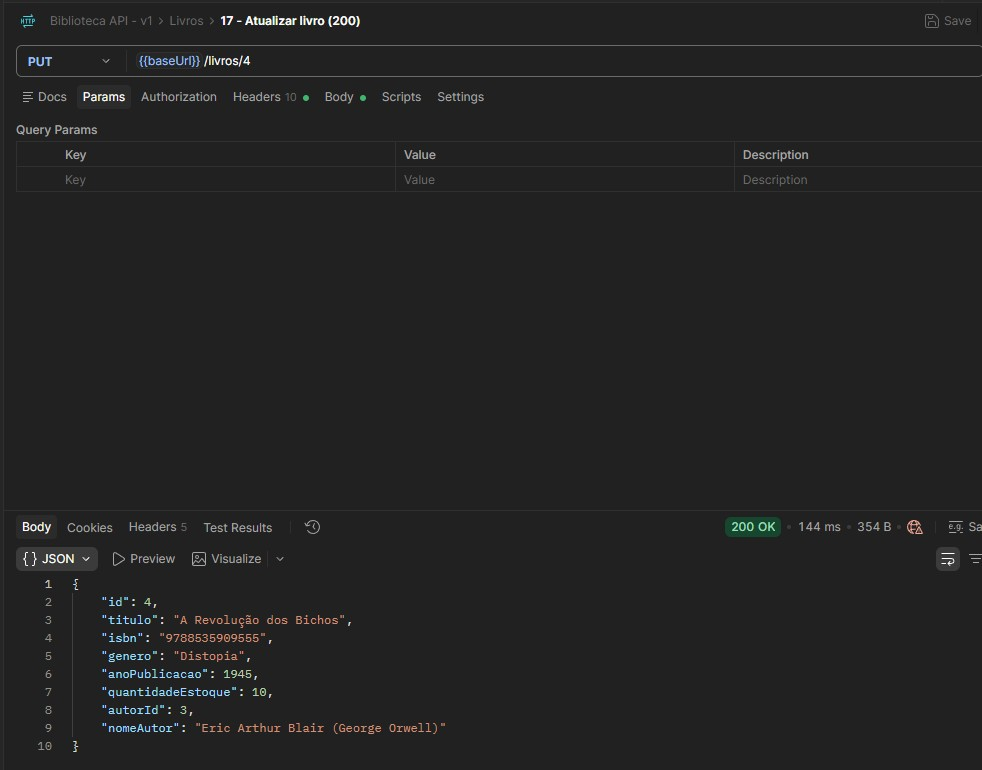 |
| 18 | DELETE `/autores/{id}`: 409 (autor com livros) | 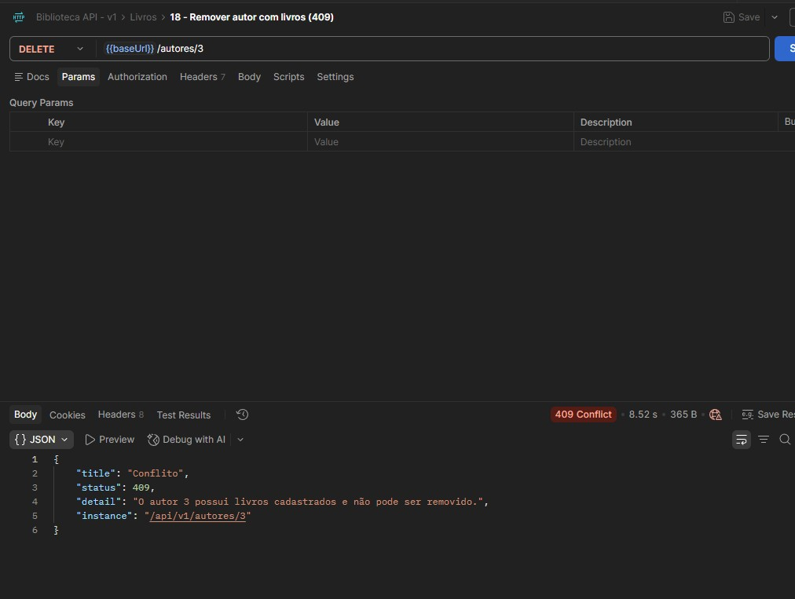 |
| 19 | DELETE `/livros/{id}`: 204 | 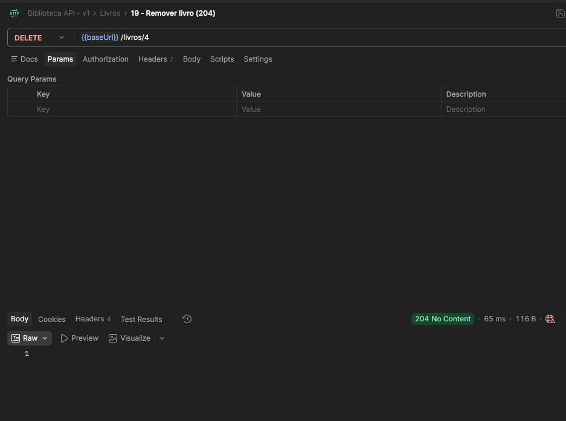 |
| 20 | DELETE `/livros/{id}`: 404 | 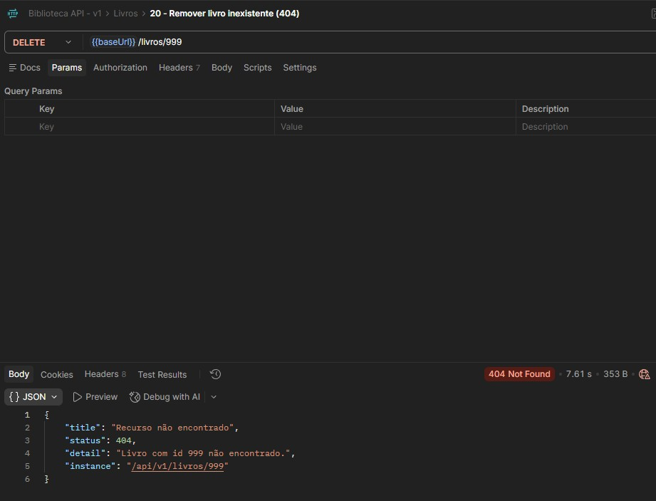 |
| 21 | DELETE `/autores/{id}`: 204 | 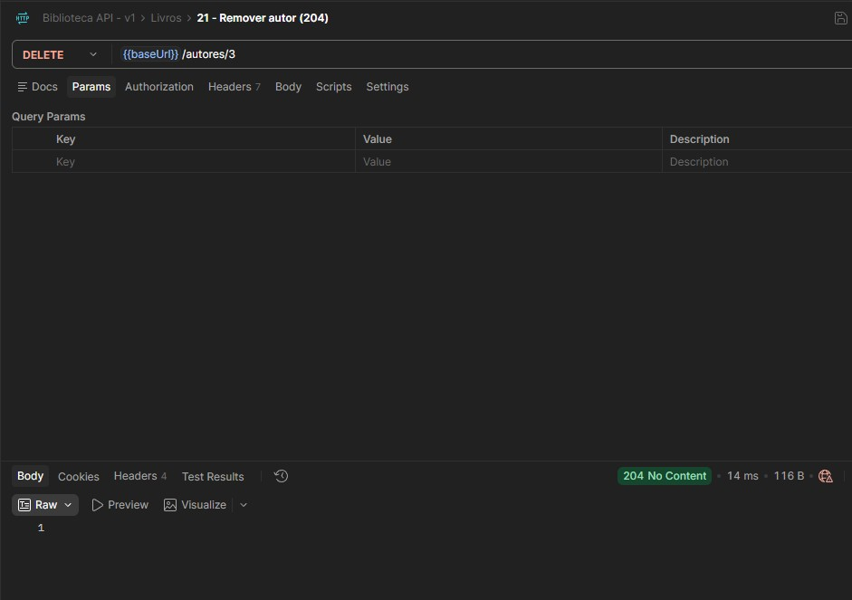 |
# cp5-csharp
